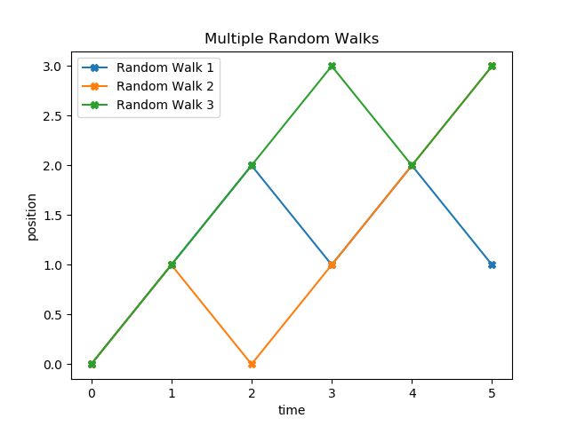

# Beginner Projects
5 Beginner Python Projects
## Table of contents
* [Introduction](#introduction)
* [Projects](#projects)
* [License](#license)
## Introduction
A YouTube channel called [Python Programmer](https://www.youtube.com/user/consumerchampion) made a [video](https://www.youtube.com/watch?v=SrSl6T1My00) suggesting five projects beginners in Python can do. Since I have to stay at home right now because of the spread of COVID-19 disease in my country, I decided to spend my free time doing these projects and sharing them on my GitHub account.

`Disclaimer:` These projects are meant to be challenging but not impossible to someone who has been studying Python for some time, so I genuinely recommend you to try to solve them by yourself before looking at the solutions.
## Projects
### 1. Binary walk
Plot a random walk using the equation `y(t) = y(t - 1) + e` (where “e” is a random number) and the library Matplotlib firstly in one dimension, and then in two dimensions or multiple random walks on the same axis.

**1D Random Walk**

**Sources:**

This [video](https://www.youtube.com/watch?v=stgYW6M5o4k) from the channel PBS Infinite Series explains what a random walk is.

I used this [article](https://www.khanacademy.org/computing/computer-programming/programming-natural-simulations/programming-randomness/a/random-walks) from Khan Academy to get inspiration for my 2D random walk graphic.

In addition, I found this [explanation](https://www.mit.edu/~kardar/teaching/projects/chemotaxis(AndreaSchmidt)/more_random.htm) from MIT on how bacteria use random walk to move.
### 2. Logistic difference equation
### 3. Calculator
### 4. Blackjack
### 5. Playing card object
## License
