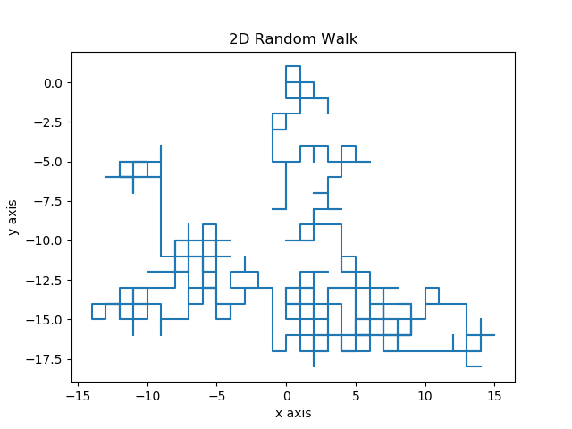
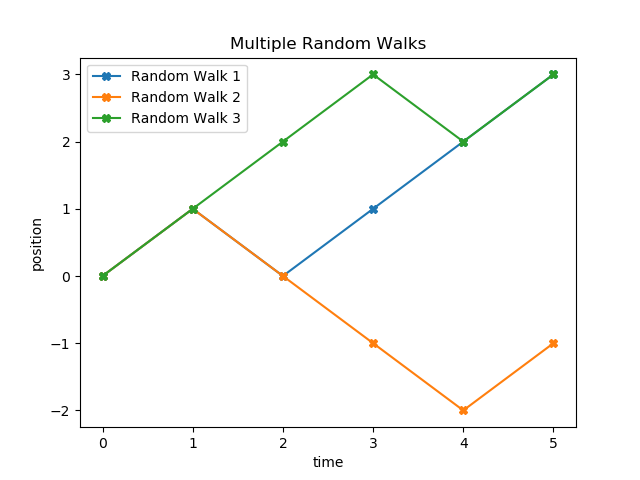

# Beginner Projects
5 Beginner Python Projects.
## Table of contents
* [Introduction](#introduction)
* [Projects](#projects)
* [License](#license)
## Introduction
A YouTube channel called [Python Programmer](https://www.youtube.com/user/consumerchampion) made a [video](https://www.youtube.com/watch?v=SrSl6T1My00) suggesting five projects beginners in Python can do. Since I have to stay at home right now because of the spread of COVID-19 disease in my country, I decided to spend my free time doing these projects and sharing them on my GitHub account.

`Disclaimer:` These projects are meant to be challenging but not impossible to someone who has been studying Python for some time, so I genuinely recommend you to try to solve them by yourself before looking at the solutions.
## Projects
### 1. Binary walk
Plot a random walk using the equation `y(t) = y(t - 1) + e` (where “e” is a random number) and the library Matplotlib firstly in one dimension, and then in two dimensions or multiple random walks on the same axis.

**1D Random Walk**

**2D Random Walk**

**Multiple Random Waks**

**Sources:**

This [video](https://www.youtube.com/watch?v=stgYW6M5o4k) from the channel PBS Infinite Series explains what a random walk is.

I used this [article](https://www.khanacademy.org/computing/computer-programming/programming-natural-simulations/programming-randomness/a/random-walks) from Khan Academy to get inspiration for my 2D random walk graphic.

In addition, I found this [explanation](https://www.mit.edu/~kardar/teaching/projects/chemotaxis(AndreaSchmidt)/more_random.htm) from MIT on how bacteria use random walk to move.
### 2. Logistic difference equation
Plot the logistic difference equation `xn+1 = r* xn * (1 - xn)` (where "r" is the growth rate and "x" is percentage of the maximum) using the library Matplotlib.

**Logistic difference equation**

**Bifurcation diagram**

**Sources:**

This is the [Veritassium video](https://www.youtube.com/watch?v=ovJcsL7vyrk) Giles from Python Programmer referred to.

### 3. Calculator

Build a calculator. Begin with a text calculator that should prompt the user for input and then give them options. The system should ask whether they want to carry on doing that or to exit. Then move on by doing it graphically with Tkinter.

**GUI Calculator**

**Sources:**

This [tutorial](https://www.datacamp.com/community/tutorials/gui-tkinter-python) from DataCamp explains how to use Tkinter and shows another way to build a GUI calculator as well.

### 4. Blackjack
### 5. Playing card object
Write a class that will create a playing card object.

**Sources:**

If you want more details on how to write a program to simulate a playing card, the [chapter 18](http://greenteapress.com/thinkpython/html/thinkpython019.html) of the book Think Python covers this topic.

## License
This project is licensed under the MIT License - open the [LICENSE.md](https://github.com/LFuciarelli/beginner-projects/blob/master/LICENSE.md) file for more details.
